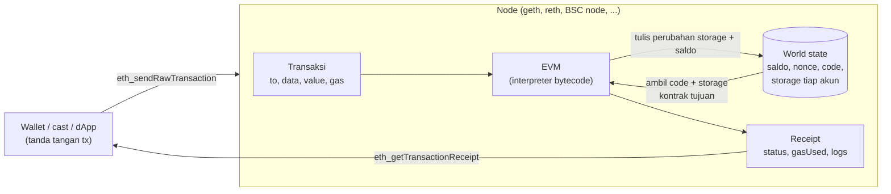

# Mesin EVM

Bagian dari [EVM 01 - EVM vs Non-EVM](../EVM%2001%20-%20EVM%20vs%20Non-EVM.md) · [EVM 01.02 - Opcode](EVM%2001.02%20-%20Opcode.md) →

## Posisi EVM di dalam node

Setiap node menjalankan program EVM yang sama. Transaksi
masuk, EVM menjalankan bytecode kontrak, hasilnya mengubah state. Semua node menjalankan
transaksi yang sama dengan urutan yang sama, jadi semuanya sampai di state yang sama.



## Isi mesinnya

Mirip komputer biasa, tapi semua bagiannya didefinisikan di spesifikasi
dan setiap langkah dibayar dengan gas.

```text
┌────────────────────────────── EVM (satu eksekusi / satu call) ─────────────────────────────┐
│                                                                                            │
│  CODE (read-only)              PC (program counter)        GAS                             │
│  60 02 60 03 01 60 00 55 00    ──► nunjuk byte ke-N        sisa gas, berkurang tiap opcode │
│  bytecode kontrak                                          habis = revert (out of gas)     │
│                                                                                            │
│  STACK (CPU register)          MEMORY (RAM)                CALLDATA (input)                │
│  maks 1024 item × 32 byte      array byte, mulai kosong    argumen dari transaksi,         │
│  semua hitungan lewat sini     makin besar makin mahal     read-only (selector + args)     │
│                                                                                            │
│  ENVIRONMENT (read-only)                                                                   │
│  msg.sender, msg.value, address(this), block.number, block.timestamp, chainid, ...         │
│                                                                                            │
└──────────────────────────────────────────┬─────────────────────────────────────────────────┘
                                           │ SLOAD / SSTORE
                              ┌────────────▼────────────┐
                              │  STORAGE (disk)         │  permanen, milik kontrak ini,
                              │  slot 0 → 0x…05         │  key 32 byte → value 32 byte,
                              │  slot 1 → …             │  paling mahal
                              └─────────────────────────┘
   Output: RETURN data · LOG (event) · REVERT (batalkan semua perubahan)
```

| Bagian | Analogi komputer | Bertahan setelah transaksi? |
| --- | --- | --- |
| Code | program di ROM | ya (tidak bisa diubah) |
| Stack | register CPU | tidak |
| Memory | RAM | tidak |
| Storage | hard disk | **ya** |
| Calldata | argumen command line | tidak (tapi tercatat di transaksi) |
| Log | file log | ya (di receipt, tidak bisa dibaca kontrak) |

## Jalan langkah demi langkah

Program 9 byte `0x600260030160005500` artinya "hitung 2 + 3,
simpan di storage slot 0". Kolom stack ditulis dengan elemen paling atas di kanan.

| PC | Byte | Opcode | Stack setelahnya | Gas |
| ---: | --- | --- | --- | ---: |
| 0 | `60 02` | PUSH1 2 | `[2]` | 3 |
| 2 | `60 03` | PUSH1 3 | `[2, 3]` | 3 |
| 4 | `01` | ADD | `[5]` | 3 |
| 5 | `60 00` | PUSH1 0 | `[5, 0]` | 3 |
| 7 | `55` | SSTORE (slot = 0, value = 5) | `[]` → storage slot 0 = 5 | 22.100 |
| 8 | `00` | STOP | | 0 |

Total eksekusi 22.112 gas. SSTORE paling mahal karena menulis ke storage permanen yang
disimpan semua node (20.000 untuk 0 → bukan nol + 2.100 akses slot "dingin").

Bukti (2026-10-03, anvil lokal): program di atas di-deploy sebagai kontrak lalu dipanggil.
`cast run <tx> -vvvvv` → `storage changes: @ 0: 0 → 5`, gas eksekusi `[22112]`, total
`gasUsed` 43.112 = 21.000 (biaya dasar transaksi) + 22.112. Kolom stack di tabel diturunkan dari definisi
opcode; totalnya cocok. Trace per langkah bisa dilihat dengan `cast run <tx> -t` (lihat
[EVM 01.07 - Program Counter](EVM%2001.07%20-%20Program%20Counter.md)).

---

Bagian dari [EVM 01 - EVM vs Non-EVM](../EVM%2001%20-%20EVM%20vs%20Non-EVM.md) · [EVM 01.02 - Opcode](EVM%2001.02%20-%20Opcode.md) →
