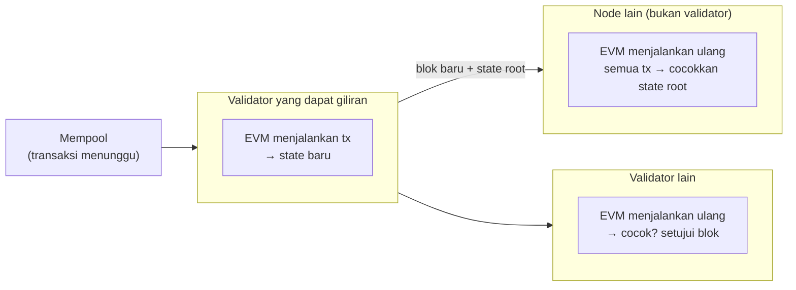

# EVM, Node, dan Validator

Bagian dari [EVM 01 - EVM vs Non-EVM](../EVM%2001%20-%20EVM%20vs%20Non-EVM.md) · ← [EVM 01.12 - Native Token](EVM%2001.12%20-%20Native%20Token.md)

Pertanyaan: EVM itu node blockchain yang menjadi validator?

**Bukan.** Ada tiga hal yang berbeda:

| Istilah | Apa | Contoh |
| --- | --- | --- |
| **EVM** | program yang menjalankan bytecode kontrak; bagian dari software client | interpreter di dalam geth, reth, client BSC |
| **Node** | komputer yang menjalankan software client: menyimpan state, terhubung ke node lain (P2P), melayani RPC `eth_*` | node RPC publicnode, node yang kamu jalankan sendiri, `anvil` (node lokal tanpa jaringan) |
| **Validator** | node yang punya kunci + stake dan diberi hak membuat dan menyetujui blok | Ethereum: stake 32 ETH per validator; BSC: 45 validator yang dipilih lewat stake BNB |

Jadi EVM ada **di dalam** node, dan validator adalah **peran** yang dipegang sebagian node.
Analogi: EVM = mesin, node = mobil, validator = mobil yang punya izin taksi. Mobil pribadi
memakai mesin yang sama, tapi tidak boleh mengangkut penumpang.

## Semua node menjalankan EVM, bukan cuma validator

Validator membuat blok. Node lain tidak percaya begitu saja: setiap node menjalankan ulang
semua transaksi di blok itu lewat EVM-nya sendiri. Kalau hasil state-nya beda dengan yang
ditulis validator, blok itu ditolak.

Karena itu EVM harus **deterministik**: input yang sama harus menghasilkan output yang sama
di semua node. Ini alasan EVM tidak punya akses internet, jam sistem, atau angka acak
sungguhan (lihat [EVM 01.05 - Environment](EVM%2001.05%20-%20Environment.md)).

| | Node biasa | Validator |
| --- | --- | --- |
| Menjalankan EVM | ya, untuk memeriksa setiap blok | ya, untuk menyusun dan memeriksa blok |
| Menyimpan state | ya | ya |
| Melayani RPC | bisa | bisa (biasanya dimatikan demi keamanan) |
| Menentukan isi dan urutan blok | tidak | ya, saat dapat giliran |
| Butuh stake | tidak | ya |
| Dapat reward | tidak | ya (priority fee, reward blok) |

## Ethereum vs BSC: susunan software node

**Ethereum** memisahkan node menjadi dua program sejak The Merge (2022):

- **Execution client** (geth, reth, Nethermind, Besu, Erigon): berisi EVM, state, mempool,
  dan RPC `eth_*`.
- **Consensus client** (Prysm, Lighthouse, Teku, Nimbus, Lodestar): PoS, memilih rantai
  yang benar, dan menentukan siapa yang membuat blok.
- Keduanya berbicara lewat Engine API (`engine_*`, lihat [EVM 01.11 - RPC eth](EVM%2001.11%20-%20RPC%20eth.md)).
- Validator = dua program di atas + **validator client** yang memegang kunci validator.

**BSC** cuma satu program (fork geth) yang menggabungkan eksekusi dan konsensus PoSA.
Daftar validatornya disimpan di **kontrak sistem** `0x0000000000000000000000000000000000001000`,
jadi daftar itu sendiri dijalankan oleh EVM.

## Bukti (2026-10-10)

| Cek | Hasil |
| --- | --- |
| `cast client` ke `ethereum-rpc.publicnode.com` | `reth/v2.7.0-3d592ec/x86_64-unknown-linux-gnu` → node RPC ini adalah execution client reth |
| `cast client` ke `bsc-dataseed.bnbchain.org` | `Geth/v1.7.7/linux-amd64/go1.25.12` → client BSC adalah fork geth dengan nomor versi sendiri |
| Field `miner` 20 blok Ethereum (26.160.207–26.160.226) | 4 alamat (12, 6, 1, dan 1 blok); salah satunya `0x0000…0000` |
| Field `miner` 20 blok BSC (126.779.522–126.779.541) | hanya 3 alamat (8, 6, dan 6 blok) |
| `getValidators()` di kontrak sistem BSC `0x…1000` | 45 alamat; ketiga pembuat blok di atas ada di daftar; code kontrak 29.871 byte |

Catatan untuk field `miner`:

- **BSC:** isinya alamat validator yang membuat blok. Satu validator membuat beberapa blok
  berturut-turut per giliran, jadi 20 blok cuma berisi 3 alamat. Urutan per giliran ini dari
  pengetahuan umum; yang dicek cuma jumlah blok per alamat, bukan urutannya.
- **Ethereum:** isinya *fee recipient*, bukan identitas validator. Sejak MEV-Boost banyak blok
  disusun builder, jadi alamat yang muncul sering milik builder. Validator Ethereum dikenali
  lewat *proposer index* di beacon chain, yang tidak ada di blok execution. Ini dari pengetahuan
  umum; belum dicek lewat beacon API.

---

Bagian dari [EVM 01 - EVM vs Non-EVM](../EVM%2001%20-%20EVM%20vs%20Non-EVM.md) · ← [EVM 01.12 - Native Token](EVM%2001.12%20-%20Native%20Token.md)
