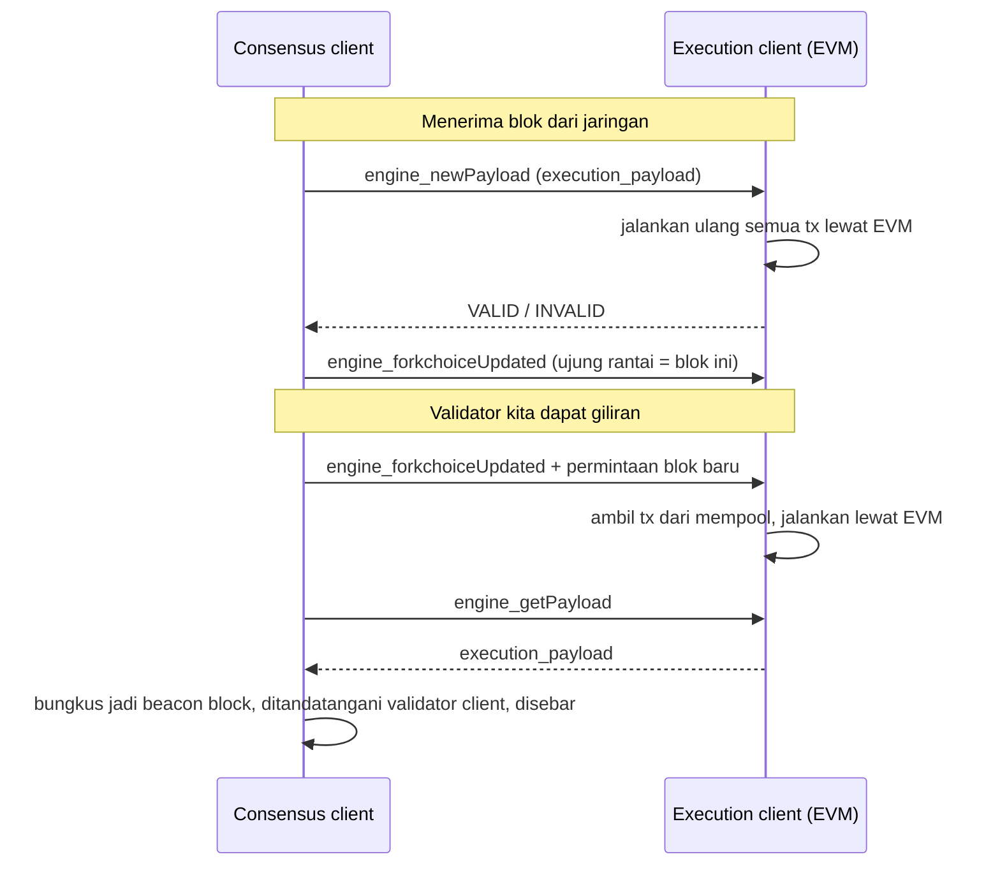

# Execution Client dan Consensus Client

Bagian dari [EVM 01 - EVM vs Non-EVM](../EVM%2001%20-%20EVM%20vs%20Non-EVM.md) · ← [EVM 01.13 - EVM, Node, dan Validator](EVM%2001.13%20-%20EVM%2C%20Node%2C%20dan%20Validator.md) · [EVM 01.15 - Validator Client](EVM%2001.15%20-%20Validator%20Client.md) →

Pertanyaan: execution client dan consensus client bedanya apa?

**Execution client** mengurus **isi** blok: menjalankan transaksi lewat EVM dan menyimpan
state. **Consensus client** mengurus **blok mana yang sah**: siapa yang boleh membuat blok,
blok mana yang disetujui mayoritas validator, dan kapan blok jadi final.

Analogi: execution client = akuntan yang menghitung saldo dari setiap transaksi. Consensus
client = rapat yang memutuskan buku besar mana yang resmi dan siapa yang mencatat giliran
berikutnya. Akuntan tidak bisa memutuskan buku mana yang resmi, dan rapat tidak menghitung
saldo.

Sejak The Merge (2022), node Ethereum **wajib menjalankan keduanya**. Execution client saja
tidak tahu blok mana yang menjadi ujung rantai; consensus client saja tidak bisa menjalankan
transaksi.

## Perbandingan

| | Execution client | Consensus client |
| --- | --- | --- |
| Tugas | menjalankan tx lewat EVM, menyimpan state, menampung mempool | PoS: memilih pembuat blok tiap slot, mengumpulkan suara validator (attestation), memilih rantai yang benar (fork choice), finality |
| Contoh | geth, reth, Nethermind, Besu, Erigon | Prysm, Lighthouse, Teku, Nimbus, Lodestar |
| Data yang disimpan | world state (saldo, nonce, code, storage), transaksi, receipt | daftar validator dan stake-nya, attestation, checkpoint |
| API untuk aplikasi | JSON-RPC `eth_*` (yang dipakai `cast`, wallet, dApp) | Beacon API REST `/eth/v1/...` |
| Satuan waktu | nomor blok | slot (12 detik) dan epoch (32 slot) |
| Identitas pembuat blok | cuma `fee_recipient` (field `miner`) | `proposer_index` = nomor validator |
| Asal-usul | software Ethereum sejak awal (era PoW) | beacon chain, jalan terpisah sejak Desember 2020 sampai digabung di The Merge |

Validator butuh program ketiga, **validator client**, yang memegang kunci dan menandatangani
blok dan attestation. Program ini terhubung ke consensus client, bukan ke execution client
(lihat [EVM 01.15 - Validator Client](EVM%2001.15%20-%20Validator%20Client.md)).

## Satu blok Ethereum = dua lapis

Blok yang kamu lihat lewat `cast block` sebenarnya **isi** dari blok consensus (beacon block).
Beacon block membungkus `execution_payload`.

```text
Beacon block (consensus client)
├── slot, proposer_index (nomor validator), parent_root
├── attestations          ← suara validator untuk blok sebelumnya
├── randao_reveal, sync_aggregate, ...
└── execution_payload     ← "blok Ethereum" yang terlihat lewat eth_getBlockByNumber
    ├── block_number, block_hash, fee_recipient (= miner)
    ├── transactions
    └── gas_used, base_fee_per_gas, state_root, ...
```

## Cara keduanya berbicara: Engine API

Consensus client dan execution client di satu node berbicara lewat **Engine API**
(`engine_*`, port khusus dengan JWT, lihat [EVM 01.11 - RPC eth](EVM%2001.11%20-%20RPC%20eth.md)).



Nama method dan alurnya dari pengetahuan umum; port Engine API tidak terbuka untuk publik,
jadi tidak bisa dicoba dari RPC publik.

## BSC dan anvil

- **BSC** tidak memisahkan keduanya. Satu program (fork geth) berisi EVM sekaligus konsensus
  PoSA. Daftar validatornya ada di kontrak sistem (lihat [EVM 01.13 - EVM, Node, dan Validator](EVM%2001.13%20-%20EVM%2C%20Node%2C%20dan%20Validator.md)).
- **anvil** cuma execution client. Tidak ada konsensus; anvil langsung membuat blok sendiri
  setiap ada transaksi.

## Bukti (2026-10-10)

Data dari publicnode: Beacon API `ethereum-beacon-api.publicnode.com` dan JSON-RPC
`ethereum-rpc.publicnode.com`.

| Cek | Hasil |
| --- | --- |
| Beacon API `/eth/v1/node/version` | `Lighthouse/v8.2.3` (consensus client). JSON-RPC provider yang sama = reth v2.7.0 (execution client, lihat [EVM 01.13 - EVM, Node, dan Validator](EVM%2001.13%20-%20EVM%2C%20Node%2C%20dan%20Validator.md)) |
| Beacon API `/eth/v2/beacon/blocks/head` | fork `fulu`, slot **15.399.156**, `proposer_index` **2.092.386**; body berisi 13 field, salah satunya `execution_payload` |
| Isi `execution_payload` | `block_number` 26.160.253, 200 tx, `gas_used` 17.877.391, `fee_recipient` `0x3963…aa49`, `block_hash` `0xa9a4…0556` |
| `cast block 26160253` lewat JSON-RPC | hash, `miner`, jumlah tx, dan `gasUsed` **sama persis** dengan `execution_payload` di atas |
| `parentBeaconBlockRoot` di blok execution | `0xd2ea…8b86` = `parent_root` di header beacon block → blok execution menyimpan penunjuk ke lapisan consensus (EIP-4788) |
| `timestamp` blok | 1.791.613.895 = genesis beacon 1.606.824.023 + 15.399.156 × 12 → satu slot tepat 12 detik |
| Validator 2.092.386 di Beacon API | status `active_ongoing`, effective balance **32 ETH**. Identitas ini tidak ada di blok execution |

---

Bagian dari [EVM 01 - EVM vs Non-EVM](../EVM%2001%20-%20EVM%20vs%20Non-EVM.md) · ← [EVM 01.13 - EVM, Node, dan Validator](EVM%2001.13%20-%20EVM%2C%20Node%2C%20dan%20Validator.md) · [EVM 01.15 - Validator Client](EVM%2001.15%20-%20Validator%20Client.md) →
